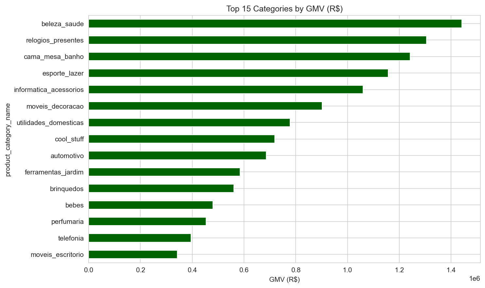
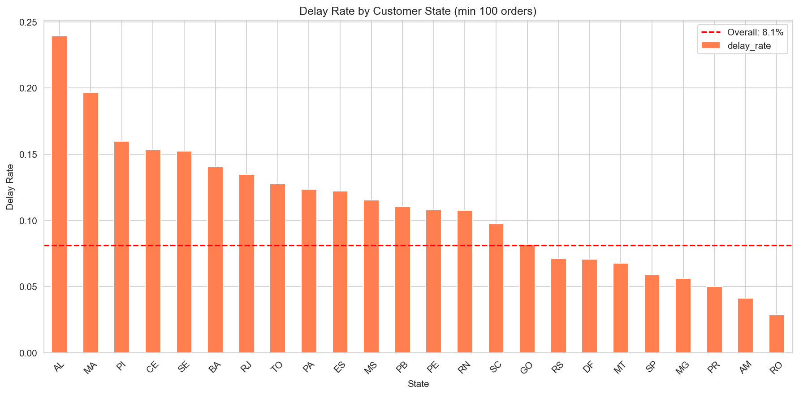
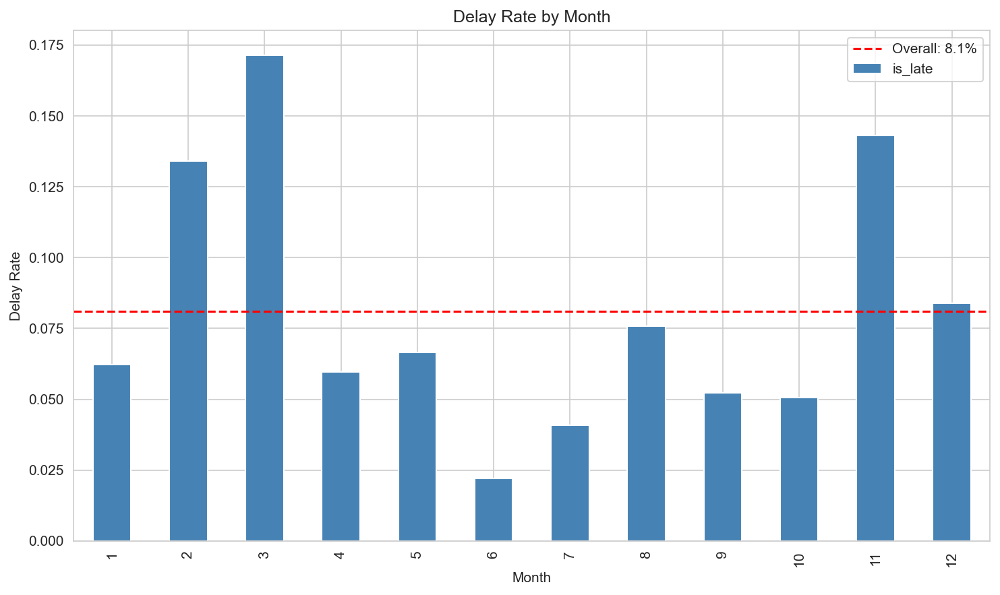
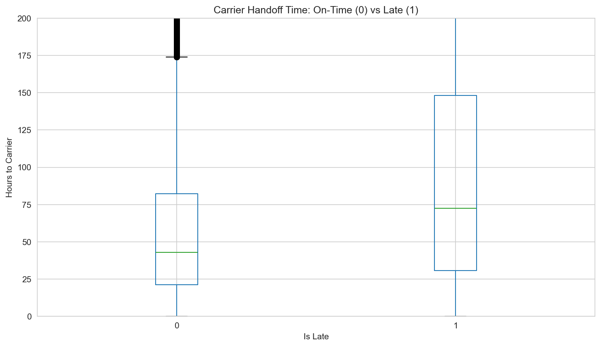
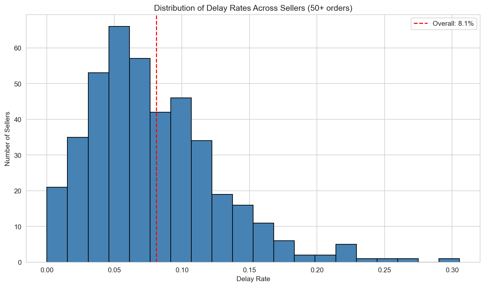
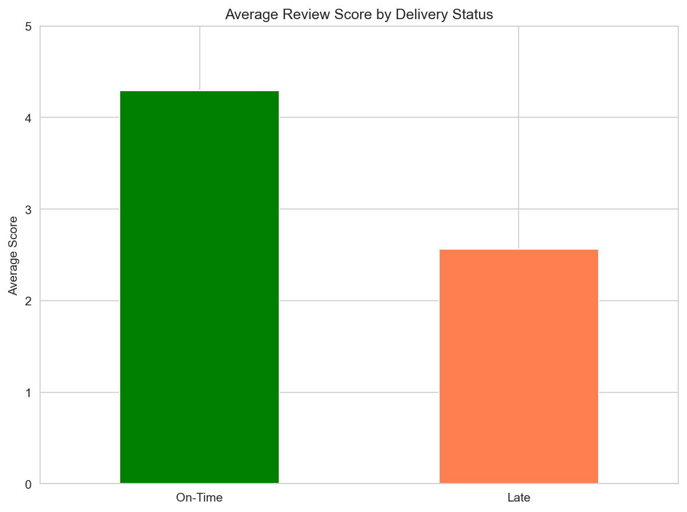

# GeraldTech Analytics Summary

> One-pager based on exploratory analysis of Olist e-commerce data.  
> Full analysis: [`notebooks/challenge-analytics.ipynb`](notebooks/challenge-analytics.ipynb)

---

## Key Metrics

| Metric | Value |
|--------|-------|
| Total Orders | 99,441 |
| Delivery Rate | 97% |
| On-Time Delivery Rate | 91.9% |
| Repeat Purchase Rate | ~0% |
| Average Review Score | 4.09 / 5 |

---

## Top Categories (by GMV)

| Category | Orders | GMV (R$) |
|----------|--------|----------|
| beleza_saude | 8,836 | 1.44M |
| relogios_presentes | 5,624 | 1.31M |
| cama_mesa_banho | 9,417 | 1.24M |
| esporte_lazer | 7,720 | 1.16M |
| informatica_acessorios | 6,689 | 1.06M |

---

## Key Insights

### 1. Geographic Delay Patterns

- Northern/remote states show significantly higher delay rates
- Worst state: AL with 23.9% delay rate vs 8.1% overall
- Driven by longer shipping distances and limited carrier coverage

---

### 2. Seasonal Delay Spikes

- Significant delay spikes in November and February-March
- November spike likely driven by Black Friday / holiday volume
- February-March spike likely post-holiday backlog and carrier recovery

---

### 3. Carrier Handoff is a Bottleneck

- Late orders take ~128h to reach carrier vs ~63h for on-time
- ~65 hour gap represents operational inefficiency before shipment

---

### 4. Problematic Sellers

- 20 sellers have delay rates >2x the platform average
- These sellers account for 2,432 delayed orders

---

### 5. Late Deliveries Hurt Reviews

- Late orders average 2.57 stars vs 4.29 for on-time (−1.73 star penalty)
- Late orders are 7x more likely to receive 1-star reviews
- Correlation: delay days vs review score = −0.27

Addressing geographic delays, carrier handoff bottlenecks, and problematic sellers would significantly improve on-time delivery rates and, consequently, customer satisfaction.

---

## Additional Observations

- **No significant payment type effect** — delay rates similar across credit card, boleto, etc.

---

*Generated from Olist dataset analysis. See notebook for methodology and full code.*
